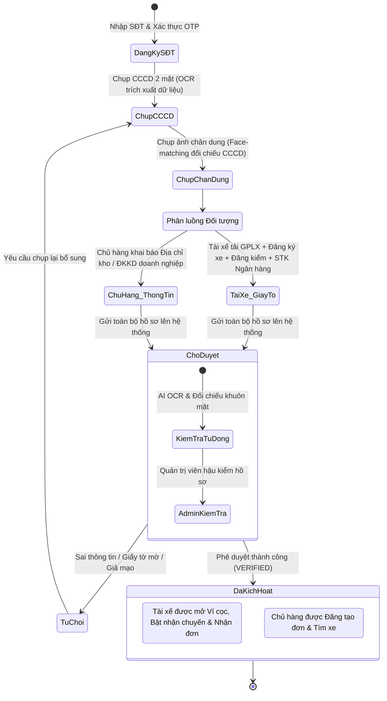
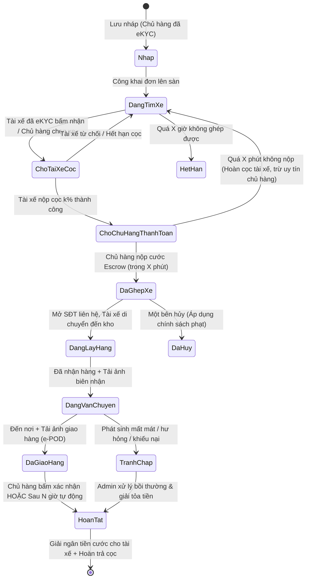
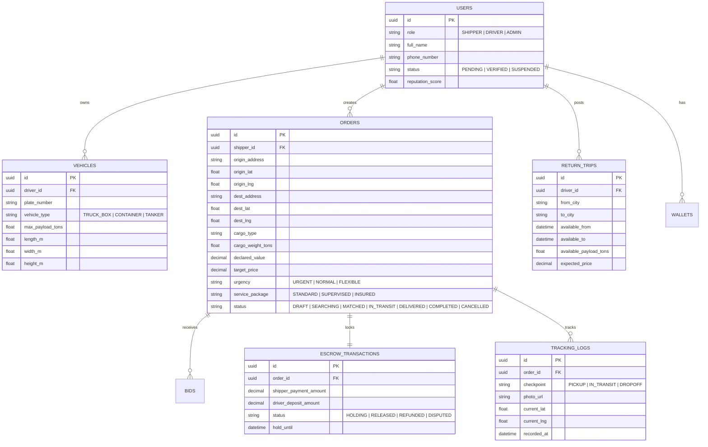

# BẢN THIẾT KẾ MVP (MINIMUM VIABLE PRODUCT)
## SÀN KẾT NỐI HÀNG HÓA VÀ PHƯƠNG TIỆN VẬN TẢI HAI CHIỀU
**Dự án tham gia:** Vietnam Young Logistics Talent 2026 (VYLT 2026)  
**Tài liệu tham chiếu:** [SPECS.md](SPECS.md) · [CONVENTIONS.md](CONVENTIONS.md) · [ARCHITECTURE.md](ARCHITECTURE.md) · [mo-ta-ben-co-hang.md](mo-ta-ben-co-hang.md) · [Giao diện Web.md](Giao%20di%E1%BB%87n%20Web.md)  
**Phiên bản:** 1.0 (MVP Release Candidate)  
**Ngày lập:** 19/09/2026  

---

## MỤC LỤC
1. [Tổng quan dự án & Định vị MVP](#1-tổng-quan-dự-án--định-vị-mvp)
2. [Phạm vi MVP (Scope & Phân loại MoSCoW)](#2-phạm-vi-mvp-scope--phân-loại-moscow)
3. [Quy tắc vận hành & Chốt bộ tham số (Bảng J)](#3-quy-tắc-vận-hành--chốt-bộ-tham-số-bảng-j)
4. [Sơ đồ trạng thái & Luồng nghiệp vụ cốt lõi](#4-sơ-đồ-trạng-thái--luồng-nghiệp-vụ-cốt-lõi)
5. [Đặc tả chức năng chi tiết theo phân hệ](#5-đặc-tả-chức-năng-chi-tiết-theo-phân-hệ)
   - 5.1. Phân hệ Chủ hàng (Shipper Portal)
   - 5.2. Phân hệ Tài xế / Nhà xe (Carrier Portal)
   - 5.3. Phân hệ Quản trị (Admin Portal)
   - 5.4. Engine Ghép nối thông minh & Cơ chế mô phỏng AI
6. [Thiết kế Kiến trúc kỹ thuật & Dữ liệu (Tech Stack & ERD)](#6-thiết-kế-kiến-trúc-kỹ-thuật--dữ-liệu-tech-stack--erd)
7. [Kịch bản Demo cuộc thi (5-Minute Pitch Demo Script)](#7-kịch-bản-demo-cuộc-thi-5-minute-pitch-demo-script)
8. [Kế hoạch triển khai & Đo lường thành công](#8-kế-hoạch-triển-khai--đo-lường-thành-công)

---

## 1. TỔNG QUAN DỰ ÁN & ĐỊNH VỊ MVP

### 1.1. Bối cảnh & Nỗi đau thị trường (Market Pain Points)
- **Tỷ lệ xe chạy rỗng chiều về tại Việt Nam lên đến 60% – 70%:** Tài xế xe tải liên tỉnh thường chỉ chở hàng một chiều, chiều về chấp nhận chạy rỗng hoặc bắt khách dọc đường không an toàn, gây lãng phí nhiên liệu, tăng phát thải CO₂ và giảm biên lợi nhuận.
- **Chủ hàng cá nhân & SME chịu chi phí cao:** Khó tiếp cận nguồn xe tải giá hợp lý khi có nhu cầu đột xuất; phụ thuộc vào môi giới (cò xe) với chi phí trung gian cắt cổ (15% - 25%).
- **Rủi ro niềm tin và an toàn giao dịch:** Chủ hàng sợ tài xế bùng cọc hoặc chiếm đoạt hàng hóa; tài xế sợ chủ hàng bùng cước hoặc chây ì thanh toán sau khi đã giao hàng xong. Hai bên thường tự ý bỏ sàn đi riêng ngoài nền tảng để trốn phí, dẫn đến mất kiểm soát rủi ro.

### 1.2. Giải pháp: Chợ vận tải 2 chiều tích hợp Smart Matching & Ký quỹ Escrow
Nền tảng kết nối trực tiếp **Bên có hàng (Chủ hàng)** và **Bên có xe (Tài xế/Nhà xe)** với 3 trụ cột khác biệt:
1. **Mô hình 2 chiều linh hoạt:** Chủ hàng đăng tìm xe; Tài xế đăng lịch rảnh/chuyến về rỗng; Engine tự động đề xuất cặp tối ưu nhất.
2. **Cơ chế giữ tiền trung gian (Escrow) song phương:** Tài xế cọc trách nhiệm theo giá trị hàng hóa; Chủ hàng nộp cước trước vào tài khoản trung gian. Chỉ mở thông tin liên hệ khi hai bên đã khóa tiền.
3. **Giám sát & Tối ưu AI:** Đề xuất giá tham chiếu, dự báo thời gian tìm xe, lọc gian lận số điện thoại trong chat, cảnh báo hàng cấm và hỗ trợ xác nhận biên bản giao nhận điện tử (e-POD).

### 1.3. Mục tiêu của bản MVP (Minimum Viable Product)
- **Mục tiêu cuộc thi:** Hoàn thiện sản phẩm demo chạy được (Working Prototype) phục vụ báo cáo và trình diễn trực tiếp trước Hội đồng Ban giám khảo VYLT 2026.
- **Mục tiêu kỹ thuật:** Luồng nghiệp vụ khép kín từ Đăng ký eKYC $\to$ Đăng tin $\to$ Ghép đơn $\to$ Ký quỹ Escrow $\to$ Theo dõi GPS/Ảnh $\to$ Xác nhận e-POD & Giải ngân.
- **Mục tiêu nghiệp vụ:** Chứng minh tính khả thi kinh tế (Unit Economics), cơ chế bảo vệ giao dịch và thuật toán tối ưu chuyến về rỗng.

---

## 2. PHẠM VI MVP (SCOPE & PHÂN LOẠI MOSCOW)

| Phân loại | Tính năng trong MVP (Bản thi) | Hướng mở rộng (Giai đoạn sau / Post-MVP) |
| :--- | :--- | :--- |
| **Must-Have** (Bắt buộc phải có) | • Đăng ký, đăng nhập OTP & eKYC cơ bản.<br>• Chủ hàng tạo đơn nguyên xe (FTL) với tọa độ bản đồ.<br>• Tài xế đăng chuyến về rỗng (Điểm đi, điểm đến, giờ rảnh).<br>• Chợ xe & Sàn hàng hóa thời gian thực (Tab Gấp, Chuyến về rỗng).<br>• Cơ chế Khóa cọc tài xế + Thanh toán tạm giữ Escrow của chủ hàng.<br>• Ẩn thông tin liên hệ cho đến khi hoàn tất ký quỹ.<br>• Cập nhật trạng thái chuyến đi & Ảnh nhận/giao hàng (e-POD).<br>• Tự động giải ngân sau $N$ giờ. | • Ghép hàng lẻ LTL (Less-than-Truckload nhiều điểm giao).<br>• Thanh toán công nợ B2B cho doanh nghiệp lớn.<br>• Tích hợp trực tiếp cảm biến IoT/Cameraman hành trình theo chuẩn Bộ GTVT.<br>• Tích hợp cổng thanh toán trực tiếp qua Ngân hàng số/NAPAS (MVP dùng giả lập Ví điện tử). |
| **Should-Have** (Nên có trong MVP) | • Thuật toán ghép nối xe về rỗng theo quy tắc cố định (Rule-based Heuristic: Khoảng cách lệch tuyến, tải trọng, thời gian).<br>• Gợi ý giá cước tham khảo theo tuyến đường.<br>• Chat nội bộ có bộ lọc ẩn số điện thoại / link liên hệ (Anti-Leakage).<br>• Bộ đếm ngược thời gian thanh toán Escrow 30 phút và tự động hủy khi quá hạn. | • Tích hợp API bảo hiểm hàng hóa tự động với công ty bảo hiểm lớn (Bảo Việt, PTI).<br>• Xuất hóa đơn điện tử tự động kết nối Tổng cục Thuế. |
| **Could-Have** (Có thể làm đơn giản) | • Gói dịch vụ nâng cao: Gói Giám sát (chia phụ phí cho tài xế). | • Điều hướng xe tối ưu nhiều trạm dừng kết hợp trạm nạp nhiên liệu xanh/xe điện.<br>• Hệ thống thưởng huy hiệu Gamification cho tài xế xanh. |
| **Won't-Have** (Giai đoạn sau / Post-MVP) | • Hỗ trợ vận chuyển đa phương thức (đường biển, đường sắt).<br>• Đấu giá cước ngược realtime phức tạp. | • **Tích hợp Trí tuệ nhân tạo (AI)**: Nhập nhanh đơn hàng bằng ngôn ngữ tự nhiên (NLP / LLM Prompt), mô hình Machine Learning học sâu từ dữ liệu giao dịch thực tế để tự động dự báo giá cước động, AI Computer Vision quét đối chiếu ảnh hàng hóa.<br>• Mở rộng thị trường quốc tế (Lào, Campuchia). |

---

## 3. QUY TẮC VẬN HÀNH & CHỐT BỘ THAM SỐ (BẢNG J)

Căn cứ Mục J và Mục I trong tài liệu mô tả gốc, các tham số kỹ thuật - nghiệp vụ được chốt chính thức cho MVP như sau:

```mermaid
graph LR
    A[Chủ hàng tạo đơn] -->|Khai báo giá trị hàng V| B(Hệ thống tính cọc tài xế k%)
    B -->|Tài xế nhận đơn| C[Tài xế khóa cọc C_driver]
    C -->|Bắt đầu đếm ngược X phút| D[Chủ hàng nạp cước Escrow]
    D -->|Hoàn tất ký quỹ| E[Mở thông tin liên lạc & Vận chuyển]
    E -->|Giao hàng + Tải ảnh POD| F[Người nhận kiểm tra]
    F -->|Sau N giờ tự động| G[Giải ngân cước + Hoàn cọc tài xế]
```



### 3.1. Bảng chốt tham số vận hành chuẩn (Resolution of Table J)

| Tham số | Ý nghĩa nghiệp vụ | Giá trị chốt cho MVP | Giải thích cơ sở lựa chọn |
| :---: | :--- | :---: | :--- |
| **$k\%$** | Tỷ lệ cọc của tài xế tính trên giá trị hàng hóa khai báo | **10%** *(Min: 300.000đ, Max: 5.000.000đ)* | Đủ sức răn đe để tài xế không bỏ chuyến hay chiếm đoạt hàng, đồng thời không quá cao gây rào cản tài chính cho tài xế cá nhân. |
| **$X$ phút** | Thời hạn Chủ hàng thanh toán cước vào Escrow sau khi Tài xế đã cọc | **30 phút** *(Hiển thị đồng hồ đếm ngược)* | Tránh việc tài xế bị giam cọc và giam lịch xe quá lâu. Nếu quá 30 phút mà chủ hàng không nộp tiền, tự động hủy ghép, hoàn cọc và phạt uy tín chủ hàng. |
| **$N$ giờ** | Thời gian tự động xác nhận đơn sau khi tài xế tải ảnh giao hàng thành công | **24 giờ** | Tránh việc chủ hàng cố tình im lặng để ngâm tiền cước của tài xế. Trong 24h nếu không có khiếu nại, hệ thống coi như giao hàng thành công. |
| **$X$ giờ** | Thời hạn tìm xe trước khi đơn hết hạn | • Đơn thường: **24 giờ**<br>• Đơn gấp: **3 giờ** | Đơn gấp ưu tiên hiển thị banner đỏ và thông báo trực tiếp tới các xe đang đứng bán kính 10km. |
| **Chu kỳ cập nhật** | Chu kỳ cập nhật vị trí & ảnh hàng hóa (Gói Giám sát) | **2 giờ / lần** | Cân bằng giữa việc đảm bảo an tâm cho chủ hàng và không gây phiền toái hoặc nguy hiểm cho tài xế đang lái xe. |
| **Phí hủy đơn** | Chế tài khi một trong hai bên hủy kèo sau khi đã ghép cặp thành công | • Hủy trước 2h lấy hàng: **Phạt 50% tiền cọc / 10% cước**.<br>• Hủy sát giờ (<2h): **Mất 100% cọc / Phạt 30% cước** bồi thường bên kia. | Đảm bảo tính cam kết, dập tắt tình trạng tài xế nhận cuốc khác rồi bỏ rơi chủ hàng hoặc chủ hàng tìm được xe ngoài rẻ hơn rồi hủy. |
| **Tỷ lệ chia phụ phí** | Tỷ lệ phụ phí Gói Giám sát chuyển cho tài xế | **60%** chuyển cho tài xế, **40%** nền tảng giữ lại | Tạo động lực (incentive) tài xế chụp ảnh đúng giờ và duy trì bật định vị GPS liên tục. |
| **Hoa hồng sàn (Take rate)** | Phí dịch vụ nền tảng thu trên mỗi chuyến thành công | **8%** giá trị cước vận chuyển (thu từ chủ hàng) | Cạnh tranh so với mức cò truyền thống (15-20%), khuyến khích giao dịch trên app. |

### 3.2. Ba gói dịch vụ chính thức
1. **Gói Tiêu Chuẩn (Standard):** Ghép xe, giữ tiền trung gian Escrow, cập nhật trạng thái lấy hàng - đang đi - đã giao, xác thực người nhận qua OTP/Ký nhận.
2. **Gói Giám Sát (Supervised - Thêm 15% cước):** Định vị lộ trình GPS trực tiếp, tài xế chụp ảnh cập nhật trạng thái thùng xe mỗi 2 giờ (chia 60% phụ phí này cho tài xế), ưu tiên đường dây nóng hỗ trợ.
3. **Gói Bảo Đảm Toàn Diện (Insured - Thêm 1.2% giá trị hàng):** Cam kết bồi thường tối đa 100% giá trị khai báo khi có sự cố mất mát, hư hỏng trong quá trình vận chuyển thông qua quỹ dự phòng của sàn.

---

## 4. SƠ ĐỒ TRẠNG THÁI & LUỒNG NGHIỆP VỤ CỐT LÕI

### 4.1. Quy trình Onboarding & Định danh eKYC bắt buộc (Chuẩn Sàn Vận Tải Quốc Gia)
Theo chính sách an toàn của nền tảng logistics, **an toàn danh tính là điều kiện tiên quyết (Prerequisite)** trước khi bất kỳ người dùng nào được tham gia vào chợ vận tải:
- **Tài xế (Driver Partner):** BẮT BUỘC xác thực Căn cước công dân (CCCD) 2 mặt + Chụp ảnh chân dung sinh trắc học + Bằng lái GPLX + Giấy tờ xe + Tài khoản ngân hàng chính chủ. **Nếu chưa được kích hoạt, hệ thống khóa hoàn toàn quyền xem chi tiết và nhận đơn.**
- **Chủ hàng (Shipper):** BẮT BUỘC xác thực CCCD 2 mặt (đối với cá nhân) hoặc Giấy đăng ký kinh doanh & CCCD người đại diện (đối với doanh nghiệp) trước khi được kích hoạt quyền tạo đơn.



> [!IMPORTANT]
> **Ràng buộc an ninh hệ thống (Hard Business Rules):**
> 1. **Khóa chức năng khi chưa eKYC:** Người dùng mới đăng ký chỉ được xem thông tin giới thiệu sàn và giao diện mẫu. Toàn bộ các nút hành động cốt lõi (*"Tạo đơn hàng"*, *"Nhận chuyến"*, *"Nạp ví cọc"*) đều bị khóa mờ kèm nhãn thông báo: *"Vui lòng hoàn thành xác thực Căn cước công dân để mở khóa chức năng"*.
> 2. **Chính chủ 1-1 (Anti-Fraud):** 01 số CCCD và 01 Số điện thoại chỉ được kích hoạt duy nhất 01 tài khoản. Tên chủ tài khoản ngân hàng liên kết nhận tiền cước bắt buộc phải trùng khớp 100% với họ tên trên CCCD đã xác thực.

### 4.2. Vòng đời trạng thái đơn hàng (Order State Machine)



### 4.3. Luồng nghiệp vụ 7 bước khép kín
1. **Bước 0 - Đăng ký & Định danh eKYC CCCD (Bắt buộc theo chuẩn bảo đảm an toàn):**
   - Chủ hàng và Tài xế đăng ký SĐT OTP $\to$ Chụp CCCD 2 mặt $\to$ Chụp ảnh chân dung $\to$ Khai báo phương tiện/tài khoản $\to$ Chờ duyệt $\to$ Nhận trạng thái `ĐÃ KÍCH HOẠT`.
2. **Bước 1 - Tạo đơn hàng & Đăng chuyến rảnh:**
   - Chủ hàng đã kích hoạt tạo đơn: Ghim điểm lấy/giao trên bản đồ, khai báo quy cách hàng hóa, **giá trị khai báo**, chọn gói dịch vụ.
   - Tài xế đã kích hoạt đăng chuyến rảnh / chuyến về rỗng: Điểm đi, điểm đến mong muốn, khung giờ rảnh, tải trọng xe trống.
3. **Bước 2 - Đề xuất & Ghép cặp thông minh [AI]:**
   - Engine tính điểm khớp (Match Score: Khoảng cách lệch tuyến, chủng loại xe, giá chào, độ uy tín).
   - Đề xuất chuyến về rỗng với giá tiết kiệm 15% - 25% cho chủ hàng.
4. **Bước 3 - Khóa cọc & Ký quỹ Escrow:**
   - Tài xế xác nhận chuyến $\to$ Hệ thống trừ/khóa $k\%$ cọc từ ví tài xế.
   - Hệ thống phát lệnh yêu cầu chủ hàng thanh toán trong vòng 30 phút.
   - Chủ hàng chuyển tiền cước vào tài khoản trung gian (Escrow).
   - Ngay khi tiền cước vào Escrow $\to$ Hệ thống mới hiển thị Số điện thoại và mở cổng chat trực tiếp.
5. **Bước 4 - Lấy hàng & Bắt đầu vận chuyển:**
   - Tài xế đến điểm hẹn, kiểm tra hàng, chụp ảnh hàng lên xe và bấm **"Đã lấy hàng"**.
   - Nếu chọn Gói Giám Sát: Cứ 2 giờ app nhắc tài xế gửi 1 ảnh cập nhật lộ trình.
6. **Bước 5 - Giao nhận & Nghiệm thu (e-POD):**
   - Tài xế đến điểm đích, người nhận kiểm tra hàng, ký nhận vào màn hình điện thoại hoặc chụp ảnh biên bản giấy kèm hàng hóa đã dỡ.
   - Tài xế nhấn **"Đã giao hàng"** $\to$ Kích hoạt bộ đếm thời gian 24 giờ ($N$ giờ).
7. **Bước 6 - Quyết toán & Đánh giá:**
   - Người nhận/Chủ hàng ấn "Xác nhận hài lòng" (hoặc hết 24h không khiếu nại) $\to$ Tiền cước tự động chuyển vào Ví thu nhập của tài xế (đã trừ 8% phí sàn), cọc $k\%$ được mở khóa ngay lập tức.
   - Hai bên chấm điểm sao và đánh giá uy tín lẫn nhau.

---

## 5. ĐẶC TẢ CHỨC NĂNG CHI TIẾT THEO PHÂN HỆ

### 5.1. Phân hệ Chủ hàng (Shipper Portal)
*Theo cấu trúc chuẩn tại [mo-ta-ben-co-hang.md](file:///d:/Workspace/log-Thao/mo-ta-ben-co-hang.md):*

1. **Quy trình Định danh Chủ hàng (eKYC bắt buộc):**
   - **Chủ hàng Cá nhân:** Nhập SĐT $\to$ Xác thực OTP $\to$ Chụp CCCD 2 mặt (tự động nhận diện OCR họ tên, số CCCD, ngày sinh, địa chỉ) $\to$ Chụp ảnh chân dung đối chiếu khuôn mặt.
   - **Chủ hàng Doanh nghiệp:** Chụp CCCD người đại diện pháp luật $\to$ Tải Giấy phép ĐKKD (Mã số thuế, tên công ty, địa chỉ trụ sở/kho hàng).
   - **Kiểm soát phân quyền:** Chỉ tài khoản có trạng thái `ĐÃ DUYỆT (VERIFIED)` mới xuất hiện nút **"+ Tạo đơn hàng mới"**. Nếu chưa duyệt, màn hình hiển thị thanh thông báo: *"Tài khoản của bạn đang chờ xác thực CCCD/ĐKKD để đảm bảo an toàn giao dịch"*.

2. **Dashboard Tổng quan:**
   - Thống kê: Đơn đang tìm xe, Đơn đang vận chuyển, Đơn cần thanh toán gấp (kèm đồng hồ đếm ngược).
   - Mini-map giám sát realtime các xe đang chở hàng của mình.
   - Banner cảnh báo AI: Nhắc nhở điều chỉnh giá cước hoặc mở rộng khung giờ nếu đơn bị ngâm lâu.
3. **Module Tạo đơn hàng (Wizard 4 bước tinh gọn cho MVP):**
   - *Bước 1 (Lộ trình):* Điểm lấy $\to$ Điểm giao (tích hợp Autocomplete địa chỉ + Pin bản đồ), ngày giờ, chọn mức độ Gấp / Tiêu chuẩn / Chấp nhận xe rỗng.
   - *Bước 2 (Hàng hóa):* Loại hàng, khối lượng (tấn), thể tích ($m^3$), quy cách đóng gói, giá trị hàng hóa khai báo (kèm cảnh báo tính cọc), cam kết hàng cấm.
   - *Bước 3 (Yêu cầu xe & Dịch vụ):* Chọn loại xe (tải thùng, bạt, lạnh, container), chọn Gói dịch vụ (Tiêu chuẩn / Giám sát / Bảo đảm).
   - *Bước 4 (Chi phí & Đăng đơn):* Hệ thống gợi ý giá cước thị trường; Chủ hàng có thể chọn giá gợi ý hoặc tự đặt giá; Xác nhận điều khoản sàn.
   - *Tính năng AI Prompt:* Ô nhập nhanh bằng ngôn ngữ tự nhiên (Ví dụ: *"Cần xe 5 tấn chở gạch từ KCN Sóng Thần về Biên Hòa sáng mai, giá 1tr5"* $\to$ Tự động điền form).
4. **Module Chợ xe & Quản lý đơn:**
   - Danh sách xe đang có chuyến về rỗng khớp tuyến đường.
   - Chi tiết đơn hàng: Xem tiến trình, hồ sơ tài xế (biển số, sao uy tín, số chuyến thành công), nút gọi điện thoại (chỉ bật khi đã escrow).
5. **Module Theo dõi hành trình & Biên bản giao nhận:**
   - Lộ trình GPS di chuyển thực tế của xe.
   - Thư viện ảnh: Ảnh lúc lấy hàng, ảnh định kỳ mỗi 2h (nếu có), ảnh ký nhận khi giao hàng.
   - Nút "Báo cáo sự cố / Khiếu nại" (đóng băng thanh toán nếu xảy ra tranh chấp).

---

### 5.2. Phân hệ Tài xế / Nhà xe (Carrier Portal)
*Theo cấu trúc chuẩn tại [Giao diện Web.md](file:///d:/Workspace/log-Thao/Giao%20di%E1%BB%87n%20Web.md):*

1. **Quy trình Đăng ký & eKYC Đối tác Tài xế (Chuẩn logistics 7 bước nghiêm ngặt):**
   - **Bước 1 (Số điện thoại):** Nhập SĐT $\to$ Nhận mã OTP qua tin nhắn SMS để kích hoạt tài khoản ban đầu.
   - **Bước 2 (Xác thực Căn cước công dân - CCCD):** Chụp ảnh CCCD mặt trước và mặt sau. Hệ thống tích hợp OCR tự động đọc và kiểm tra tính hợp lệ (Số CCCD, Họ tên, Ngày sinh, Quê quán, Ngày hết hạn).
   - **Bước 3 (Chụp ảnh chân dung sinh trắc học):** Tài xế chụp ảnh selfie trực tiếp trên camera ứng dụng. Hệ thống tự động so khớp khuôn mặt giữa ảnh chân dung và ảnh trên thẻ CCCD (Face-matching chống mượn/thuê tài khoản).
   - **Bước 4 (Giấy phép lái xe - GPLX):** Chụp ảnh 2 mặt GPLX (kiểm tra hạng bằng B2, C, D, E, FC phù hợp với loại tải trọng đăng ký).
   - **Bước 5 (Đăng ký phương tiện):** Khai báo biển số xe, nhãn hiệu, loại thùng (thùng kín, mui bạt, đông lạnh), tải trọng tối đa, kích thước thùng (Dài x Rộng x Cao). Tải lên ảnh Cà vẹt (Đăng ký xe), Giấy đăng kiểm còn hạn, Bảo hiểm TNDS bắt buộc và ảnh chụp thực tế xe.
   - **Bước 6 (Tài khoản ngân hàng chính chủ):** Nhập số tài khoản ngân hàng và tên ngân hàng nhận tiền cước. Tên chủ tài khoản bắt buộc phải trùng khớp với họ tên trên CCCD đã xác thực ở Bước 2.
   - **Bước 7 (Xét duyệt & Kích hoạt quyền nhận đơn):** 
     + Trạng thái `CHỜ DUYỆT (PENDING)`: Tài khoản bị **KHÓA TOÀN BỘ CHỨC NĂNG NHẬN ĐƠN / BẬT NHẬN CHUYẾN / NẠP VÍ CỌC**. Màn hình hiển thị: *"Hồ sơ đang được thẩm định an toàn - Dự kiến hoàn tất trong 2-24h"*.
     + Trạng thái `ĐÃ KÍCH HOẠT (ACTIVE)`: Tài xế nhận thông báo chào mừng, mở nút gạt **"Bật sẵn sàng nhận chuyến"** và kích hoạt Ví cọc.

2. **Đăng chuyến xe rảnh & Chuyến về rỗng (Return Trip Optimizer):**
   - Tài xế nhập: Đang ở đâu $\to$ Muốn về đâu $\to$ Khung giờ dự kiến xuất phát $\to$ Trọng tải thùng xe còn trống $\to$ Mức giá mong muốn (thường rẻ hơn 20-30% để hút khách).
3. **Sàn tìm hàng & Nhận chuyến (Chỉ mở cho tài xế đã kích hoạt eKYC):**
   - Bộ lọc: Bán kính xung quanh, tuyến đường mong muốn, khối lượng, cước tối thiểu.
   - Tab **"Gấp"**: Các đơn cần bốc hàng trong vòng 2-4h với cước cao.
   - Tab **"Gợi ý cho bạn [AI]"**: Các đơn hàng khớp 85% - 100% với chiều về rỗng của xe.
4. **Nhận đơn & Ký quỹ:**
   - Xem chi tiết đơn (tuyến đường, mặt hàng, giá cước, số tiền cọc $k\%$ cần nộp).
   - Nút **"Nhận đơn & Nộp cọc"**: Trừ tiền ví cọc $\to$ Chuyển sang chờ chủ hàng nộp cước $\to$ Nhận thông báo kèm SĐT chủ hàng khi hoàn tất.
5. **Thực thi cuốc xe & Báo cáo lộ trình:**
   - Nút chuyển trạng thái nhanh: `Đang đến lấy` $\to$ `Đã lấy hàng (Tải ảnh)` $\to$ `Đang chạy` $\to$ `Đã tới nơi` $\to$ `Đã giao (Tải ảnh POD)`.
   - Quản lý ví: Ví cọc (để nhận đơn) & Ví thu nhập (rút tiền về tài khoản ngân hàng sau khi hoàn tất đơn).

---

### 5.3. Phân hệ Quản trị (Admin Portal)
1. **Duyệt hồ sơ eKYC CCCD & Giấy phép vận tải:**
   - Màn hình đối chiếu trực quan 3 cột: Ảnh CCCD 2 mặt vs Ảnh chân dung Selfie vs Ảnh Giấy phép lái xe / Đăng ký xe.
   - Công cụ duyệt 1 chạm: Phê duyệt (Kích hoạt tức thì) hoặc Từ chối (chọn lý do: ảnh mờ, bằng lái hết hạn, tên ngân hàng không khớp).
2. **Giám sát giao dịch & Tài khoản Escrow:**
   - Theo dõi dòng tiền nạp - giữ - giải ngân.
   - Thống kê tổng giá trị hàng hóa đang lưu thông trên sàn.
3. **Trung tâm xử lý tranh chấp (Dispute Center):**
   - Xem bằng chứng ảnh lấy hàng vs ảnh giao hàng, lịch sử chat.
   - Phân xử bồi thường: Trừ cọc tài xế đền cho chủ hàng, hoặc giải ngân cước cho tài xế nếu chủ hàng gây khó dễ vô cớ.

---

### 5.4. Engine Ghép nối thông minh & Cơ chế mô phỏng AI (Matching Engine)

Trong bản thi MVP, để đảm bảo tính ổn định tối đa mà vẫn thể hiện chiều sâu công nghệ, thuật toán ghép nối sử dụng **Weighted Multi-Criteria Heuristic (Chấm điểm trọng số chuyên gia)** mô phỏng mạng nơ-ron:

$$\text{MatchScore} = w_1 \cdot S_{\text{route}} + w_2 \cdot S_{\text{capacity}} + w_3 \cdot S_{\text{time}} + w_4 \cdot S_{\text{reputation}} + w_5 \cdot S_{\text{price}}$$

Trong đó:
- $S_{\text{route}}$ (Trọng số 0.35): Độ lệch khoảng cách giữa điểm lấy/giao của chủ hàng và lộ trình về rỗng của xe (tính bằng công thức Haversine/OSRM).
- $S_{\text{capacity}}$ (Trọng số 0.25): Độ khớp giữa tải trọng/thùng xe với kích thước hàng hóa (ưu tiên xe vừa vặn nhất để tối ưu chi phí).
- $S_{\text{time}}$ (Trọng số 0.15): Độ khớp giữa giờ hẹn lấy hàng và giờ xe sẵn sàng.
- $S_{\text{reputation}}$ (Trọng số 0.15): Điểm uy tín của tài xế/chủ hàng (đánh giá sao, tỷ lệ hủy đơn thấp, thời gian hoàn thành đơn).
- $S_{\text{price}}$ (Trọng số 0.10): Độ chênh lệch giữa giá chủ hàng đề xuất và giá sàn gợi ý.

**Các tính năng AI bổ trợ:**
- **AI Anti-Leakage (Chống đi đêm):** Quét tin nhắn chat thời gian thực bằng Regex & NLP cơ bản để nhận diện số điện thoại, tài khoản Zalo, link mạng xã hội hoặc từ khóa giao dịch ngoài. Lập tức che dấu `***` và hiển thị cảnh báo vi phạm.
- **AI Cargo Risk Warning:** Kiểm tra từ khóa danh mục hàng cấm (chất cháy nổ, động vật hoang dã, hóa chất độc hại) và cảnh báo chủ hàng trước khi đơn được phê duyệt.

---

## 6. THIẾT KẾ KIẾN TRÚC KỸ THUẬT & DỮ LIỆU (TECH STACK & ERD)

### 6.1. Tech Stack đề xuất cho bản MVP

```
+-------------------------------------------------------------------------+
|                                FRONTEND                                 |
|   • Next.js 14 / React (TypeScript)                                     |
|   • Tailwind CSS (Design System chuẩn Logistics: Dark Navy & Neon Amber)|
|   • Leaflet / Mapbox GL (Hiển thị bản đồ lộ trình & vị trí xe)          |
|   • Responsive Web App (Tương thích Desktop cho Chủ hàng & Mobile cho Tài xế)|
+-------------------------------------------------------------------------+
                                    │  RESTful API / WebSocket
+-------------------------------------------------------------------------+
|                                BACKEND                                  |
|   • Node.js (NestJS / Express) hoặc Python FastAPI                      |
|   • JWT Authentication & Role-based Access Control (Shipper, Driver, Admin)|
|   • Socket.io (Thông báo trạng thái đơn hàng & chat thời gian thực)     |
|   • Background Worker: Cron job tự động hủy quá hạn & tự động giải ngân |
+-------------------------------------------------------------------------+
                                    │
+-------------------------------------------------------------------------+
|                         DATABASE & CLOUD STORAGE                        |
|   • PostgreSQL (Quan hệ thực thể: Users, Orders, Bids, Escrow Ledger)  |
|   • Redis (Cache kết quả Matching Score & quản lý bộ đếm ngược)         |
|   • Cloudinary / Supabase Storage (Lưu trữ ảnh eKYC & ảnh e-POD)        |
+-------------------------------------------------------------------------+
```

### 6.2. Sơ đồ thực thể dữ liệu cốt lõi (Core ERD)



---

## 7. KỊCH BẢN DEMO CUỘC THI (5-MINUTE PITCH DEMO SCRIPT)

Kịch bản được thiết kế riêng để đội ngũ thuyết trình trước Ban Giám khảo Vietnam Young Logistics Talent 2026, làm nổi bật ngay sự trơn tru của luồng nghiệp vụ:

| Mốc thời gian | Màn hình Demo | Hành động & Lời thoại chính | Điểm nhấn ghi điểm với BGK |
| :---: | :--- | :--- | :--- |
| **00:00 - 01:00** | **Màn hình Chủ hàng** | • Đăng nhập tài khoản Chủ hàng doanh nghiệp đã eKYC.<br>• Sử dụng ô nhập nhanh bằng AI: *"Hải Phòng về Hà Nội, 8 tấn thép cuộn, cần xe gấp chiều nay"*.<br>• Form tự điền chính xác, ghim vị trí cảng Đình Vũ $\to$ KCN Thăng Long.<br>• Khai báo giá trị hàng 200.000.000đ $\to$ Hệ thống báo cọc tài xế 10% (max trần 5tr). | Trực quan hóa công nghệ nhập liệu tiện lợi; minh bạch cơ chế tính cọc bảo vệ tài sản. |
| **01:00 - 02:15** | **Màn hình Tài xế & Engine Ghép** | • Chuyển sang màn hình Tài xế đang có xe 10 tấn vừa giao hàng xong tại Hải Phòng và đăng "Tìm chuyến về Hà Nội".<br>• Tab **"Đề xuất cho bạn [AI]"** lập tức nhảy thông báo đơn hàng của Chủ hàng vừa tạo với điểm Match Score 96%.<br>• Tài xế bấm **"Nhận chuyến & Khóa cọc"** $\to$ Số dư ví cọc bị khóa 5.000.000đ. | Giải quyết bài toán giảm xe chạy rỗng chiều về; chứng minh thuật toán matching thông minh. |
| **02:15 - 03:30** | **Màn hình Escrow & Kích hoạt liên lạc** | • Màn hình Chủ hàng nhận thông báo có xe nhận, kèm bộ đếm ngược 30 phút thanh toán cước 3.500.000đ.<br>• Chủ hàng bấm **"Thanh toán tạm giữ"** qua Ví trung gian Escrow.<br>• Hệ thống kích hoạt trạng thái **"Đã ghép xe"** $\to$ Mở SĐT liên lạc và mở kênh chat nội bộ. Thử gõ số điện thoại vào chat $\to$ Hệ thống tự che chắn bảo mật. | Xóa bỏ nỗi sợ bùng kèo; ngăn chặn thất thoát doanh thu ngoài nền tảng. |
| **03:30 - 04:30** | **Màn hình Giám sát & e-POD** | • Tài xế tải ảnh đã nhận hàng lên thùng xe $\to$ Trạng thái chuyển sang `Đang vận chuyển`.<br>• Chủ hàng xem vị trí xe di chuyển trên bản đồ trực tiếp.<br>• Tài xế đến kho Hà Nội, người nhận ký tên trực tiếp lên màn hình điện thoại, tài xế chụp ảnh hàng hóa tại kho. Bấm `Đã giao hàng`. | Biên bản giao nhận điện tử minh bạch; cắt giảm toàn bộ chứng từ giấy truyền thống. |
| **04:30 - 05:00** | **Quyết toán & Hoàn tất** | • Màn hình Chủ hàng bấm "Xác nhận đã nhận đủ hàng".<br>• Tiền cước tự động giải ngân cho tài xế (3.220.000đ sau khi trừ 8% phí sàn), cọc 5.000.000đ được hoàn trả ngay về ví khả dụng.<br>• Hai bên chấm 5 sao uy tín. | Vòng lặp giao dịch khép kín, an toàn tuyệt đối, lợi ích hài hòa 3 bên. |

---

## 8. KẾ HOẠCH TRIỂN KHAI & ĐO LƯỜNG THÀNH CÔNG

### 8.1. Các chỉ số đo lường hiệu quả MVP (KPIs)
- **Tỷ lệ giảm giá cước chiều về:** Giảm từ 15% - 25% so với cước chiều đi truyền thống.
- **Thời gian ghép xe trung bình:** Dưới 30 phút đối với đơn thường và dưới 10 phút đối với đơn gấp.
- **Tỷ lệ tranh chấp / bùng kèo:** Dưới 1% nhờ cơ chế khóa cọc và giữ tiền trung gian Escrow.
- **Tỷ lệ hoàn tất e-POD đúng hạn:** Đạt trên 95% có đầy đủ ảnh chụp đối chứng.

### 8.2. Lộ trình phát triển 3 giai đoạn (Post-Competition Roadmap)
1. **Giai đoạn 1 (MVP - Bản thi VYLT 2026):** Hoàn thiện Web App tương thích PC/Mobile, thuật toán Heuristic Matching, cơ chế Escrow giả lập, kịch bản demo 5 phút hoàn hảo.
2. **Giai đoạn 2 (Pilot vận hành thực tế tại 1 hành lang vận tải):** Thí điểm tuyến Hà Nội - Hải Phòng hoặc TP.HCM - Bình Dương - Đồng Nai; liên kết 100 tài xế và 30 chủ hàng SME; tích hợp cổng thanh toán NAPAS/VietQR.
3. **Giai đoạn 3 (Scale toàn quốc & Mở rộng tính năng):** Ra mắt Mobile App native (iOS/Android), tính năng ghép hàng lẻ LTL, thanh toán công nợ B2B và tích hợp bảo hiểm hàng hóa tự động.

---
*Tài liệu này được biên soạn độc quyền phục vụ thiết kế hệ thống và thuyết trình đề tài tại cuộc thi Vietnam Young Logistics Talent 2026.*
